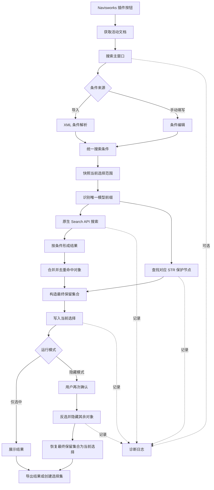

# 傑出品 Navisworks 查找插件项目知识库

> [!abstract] 一句话说明
> 这是一个运行在 Navisworks Manage 2023 内部的模型查找插件：它把 XML 或人工录入的属性条件转换为 Navisworks 原生搜索，选中命中对象，并在多重保护成立后按需隐藏其余对象。

## 1. 项目背景

### 1.1 要解决的问题

大型 Navisworks 模型中，用户常需要按名称、系统路径、标签等属性定位一批对象。人工逐项查找存在三个直接问题：

- 查询条件多时，重复操作成本高，且容易漏项。
- 模型层级深、对象数量大，应用层遍历容易让 Navisworks 长时间无响应。
- “隐藏未选中”属于高影响操作；如果查询为空或选中状态异常，可能误隐藏整个模型。

本项目的核心目标不是单纯提供一个搜索框，而是建立一条可重复、可确认、可诊断的模型筛选流程。

### 1.2 业务边界

“傑出品”工具链分为生产者和消费者两部分：

| 部分 | 责任 | 不负责的内容 |
|---|---|---|
| Python XML 生成器 | 根据业务输入生成 Navisworks exchange XML | 不直接操作 Navisworks 模型 |
| 本插件 | 解析条件，在当前模型范围内搜索、选中、保护和隐藏 | 不负责生成上游业务数据 |

两者通过 XML 条件结构解耦。上游可以独立演进，只要继续满足条件协议；插件也允许用户不经过 XML，直接在界面中添加条件。

### 1.3 典型使用场景

1. 用户在 Navisworks 中打开模型，并在选择树中选定一个模型范围。
2. 用户导入 XML，或手动填写分类、属性名、匹配方式和查询值。
3. 插件在选定范围内执行原生搜索，并汇总各条件结果。
4. 插件把命中对象与需要保护的 STR 结构对象合并为最终保留集合。
5. 用户选择仅选中，或在确认后隐藏未选中对象。
6. 用户可按已勾选、当前筛选或全部结果导出，创建原生选择集，并在需要时启用诊断日志。

## 2. 技术架构

### 2.1 技术栈

| 维度 | 当前选择 |
|---|---|
| 宿主应用 | Autodesk Navisworks Manage 2023 |
| 运行时 | .NET Framework 4.8，x64 |
| 语言与界面 | C# 7.3，WinForms |
| 插件形式 | Navisworks `AddInPlugin` + `.plugin` 清单 |
| 搜索能力 | Navisworks 原生 Search API |
| 配置输入 | Navisworks exchange XML + 手动条件 |
| 构建 | MSBuild / Visual Studio 2022 Build Tools |
| 部署 | DLL 与同名清单部署到 Navisworks `Plugins` 子目录 |

### 2.2 分层职责

| 层 | 主要组件 | 职责 |
|---|---|---|
| 宿主接入层 | `PluginEntry`、插件清单 | 注册按钮、确认活动文档、把窗口归属到 Navisworks 主窗口 |
| 交互与编排层 | `SearchDialog` | 管理条件、模式、范围、结果、确认步骤和各服务调用顺序 |
| 输入适配层 | `XmlSearchParser` | 把外部 XML 转成内部搜索条件，并校验必要结构 |
| 领域数据层 | `SearchCondition`、`SearchResult` | 表达搜索意图与每个条件的命中结果 |
| 查询执行层 | `ModelItemMatcher` | 发现分类、构建原生条件、限定范围并执行搜索 |
| 模型状态层 | `SelectionService`、`SelectionEquivalencePolicy`、`HideService` | 写入当前选择、用纯集合等价策略核验宿主实际选择、隐藏最终保留集合之外的对象 |
| 业务保护层 | `ProtectedKeepService` | 识别当前模型的 STR 节点并加入最终保留集合 |
| 可观测层 | `LogService`、`DiagnosticLogSession`、扩展方法 | 记录搜索、范围、选择、保护、确认和隐藏结果 |
| 构建部署层 | 项目文件、构建脚本、安装脚本 | 绑定 Navisworks API、生成 DLL、复制 DLL 与清单 |

### 2.3 核心调用关系

### 2.4 搜索条件语义

每个条件包含四个用户可理解的概念：

| 概念 | 含义 |
|---|---|
| 分类 | Navisworks 属性面板中的属性分组，可省略 |
| 属性名 | 属性面板左侧显示的字段名，是必要信息 |
| 匹配方式 | 完全相同或包含指定文字，均忽略大小写 |
| 查询值 | 属性面板右侧希望匹配的值 |

条件快照会分别保留分类与属性的显示标识和内部标识；CSV 与可选诊断日志都输出这四个原始字段，而不是只输出回退后的名称。

结果行的导出复选框只保存条件显示序号，不复用 DataGridView 高亮行或 Navisworks CurrentSelection。勾选状态可跨结果筛选保留；表头批量操作只影响当前筛选下的可见条件。导出时再以最新有效结果做交集，自动排除失效序号。

多个条件会分别执行搜索，最终结果取并集并去重。因此，当前多条件语义是独立条件的 OR：条件 A 或条件 B 命中即可进入对象级结果；它不是把多个条件组合成一个“同时满足”的 AND 查询。重复输入两条相同条件也仍是两条独立的条件级结果。

搜索已经从“是否存在”判断升级为“基数是否符合约束”：0 表示缺失，1 表示唯一有效，大于等于 2 表示模型值重复。比较方式决定如何匹配，唯一性约束决定匹配数量是否合法，两者不能混为一谈。

当分类缺失时，插件会在模型中采样最多 2000 个对象，根据属性显示名发现所属分类，并缓存本轮发现结果。这个策略提高了对简化 XML 的兼容性，但它本质上仍是启发式发现。

### 2.5 搜索范围与模型身份

当前流程要求用户先在选择树中选定范围。插件对选中根节点做快照，并直接把这些根节点交给 Navisworks Search API。它不会在 .NET 层预先展开全部后代。

选中范围还承担模型身份识别职责。插件从节点名称提取模型前缀，并要求一次操作只能得到一个唯一前缀。该前缀用于定位对应的 `{前缀}-STR` 结构节点。

> [!important] 这里有一个关键业务不变量
> 搜索范围、模型前缀和 STR 保护规则是绑定的。无法识别前缀或同时识别出多个前缀时，流程必须停止，因为插件无法可靠判断应保护哪个结构节点。

### 2.6 结果与状态管理

搜索完成后存在三类结果：

- 条件级结果：每个条件都有一个明确状态、匹配数量、说明和命中对象。
- 对象级结果：所有条件的命中对象合并并去重。
- 最终保留集合：对象级结果再加上 STR 保护节点及其后代。

条件级状态严格只有四种：匹配 0 个为“未找到”，匹配 1 个为“已找到”，匹配 2 个及以上为“重复”，条件无法构造或执行为“条件异常”。结果页支持全部、问题项、已找到、未找到、重复和条件异常筛选；双击重复行会选中该条件的全部重复对象，帮助定位模型值问题。

当前选择是一次操作的临时状态；选择集是可随 Navisworks 文档保存的持久状态。两者用途不同，因此项目保留了独立的“创建选择集”动作，而不是在每次搜索后自动创建。条件被添加、导入、编辑、删除或清空时，缓存结果立即失效，导出、选择集和其他基于旧结果的操作都必须停用直到重新搜索。

## 3. 关键设计决策

### 3.1 使用原生 Search API，而不是应用层遍历

**原因：** 大模型的主要成本不是一次属性比较，而是跨托管代码与 Navisworks 对象模型边界进行海量调用。

**做法：** 由 C++ 引擎负责范围搜索，C# 层只负责构造条件、提交范围和消费结果。

**收益：** 搜索规模增长时性能更可控，界面响应性也更好。

**代价：** 条件必须映射到 Navisworks 支持的原生表达式，复杂组合能力受 API 约束。

### 3.2 直接传递范围根节点，不预展开后代

**原因：** 用户选择的根节点已经足以描述搜索范围，提前展开后代只是重复构造大量对象。

**做法：** 把范围根节点一次性构造成原生集合，并在每个条件搜索中复用。

**收益：** 删除不必要的 DFS 和二次范围过滤，减少时间与内存消耗。

### 3.3 每个条件独立搜索，结果统一合并

**原因：** 用户更需要知道“哪条条件没有找到”，而不仅是一个总结果。

**做法：** 每个条件产生独立结果，随后用集合语义合并对象。

**收益：** 结果可解释、可导出、可诊断，并能把每条条件的唯一性问题直接暴露给用户。

**代价：** 条件数较多时会产生多次原生搜索；如果未来需要真正的 AND/OR 组合，应显式设计条件组，而不能继续依赖平铺列表。当前平铺列表始终是独立条件的 OR。

### 3.4 把隐藏设计成两段式高风险操作

**原因：** 隐藏是改变模型可见状态的高影响动作，错误输入不能直接转化为破坏性结果。

**做法：** 先搜索并展示统计。任意未找到、重复或条件异常都会暂停隐藏并要求用户在“仍然继续隐藏 / 返回检查”之间明确选择；自动弹窗和主界面“隐藏未选中”按钮共用同一执行流程。选择继续只覆盖唯一性要求，重复条件的全部匹配对象都会保留。纯 `SelectionEquivalencePolicy` 仍以集合语义比较最终保留集合与宿主 CurrentSelection 快照，任何缺失或额外对象都会阻断隐藏。

**收益：** 即使 XML 错误、范围错误或 API 状态异常，也不会轻易隐藏整个模型。

**不变量：** 没有明确确认时，问题结果不能触发隐藏；即使用户覆盖唯一性要求，零匹配、空保留集合和实际选择不一致仍不能绕过。

### 3.5 把 STR 保护作为业务规则独立封装

**原因：** STR 不是一般搜索结果，而是隐藏操作中必须保留的结构对象。

**做法：** 根据唯一模型前缀查找目标节点，命中后把节点及全部后代加入最终保留集合；已知目标就在范围根节点时直接使用快速路径。

**收益：** 业务保护规则不会散落在界面和隐藏逻辑中，也便于记录诊断信息。

### 3.6 使用 SelectionSet 作为持久结果

**原因：** 用户已经熟悉 Navisworks 的“集合”面板，搜索结果需要在插件关闭后继续使用。

**做法：** 使用 Navisworks 原生选择集，并通过复制接口写入文档集合。

**收益：** 与原生工作流一致，可继续用于颜色、透明度、隐藏和批量属性操作。

### 3.7 诊断日志默认关闭

**原因：** 日常搜索不应承担详细诊断的写入开销，但复杂模型问题又必须可追溯。

**做法：** 搜索不再自动生成普通查找日志。诊断会话仅在用户显式开启时创建，CSV 继续作为主动导出的结果载体。

**收益：** 正常使用保持轻量，排障时又能获得范围、前缀、条件、保护、选择和隐藏的完整证据链。

### 3.8 当前主项目保持 2023 单版本

项目曾尝试加入 2017—2026 多版本构建，随后将该能力迁移到独立项目，主仓库恢复为 Navisworks Manage 2023 的单版本实现。

这个决策减少了条件编译、清单变体和部署脚本对主项目的侵入。多版本兼容属于独立产品边界，不应让稳定的 2023 插件承担额外复杂度。

### 3.9 让结果可追溯，但不让旧结果继续生效

**原因：** 条件被修改后，原有状态、对象列表和导出内容不再代表当前输入。

**做法：** 结果保存条件快照、原始范围快照和去重匹配集合；输入发生变化即清空旧结果、导出勾选，并禁用导出、创建选择集和主界面隐藏按钮。XML 导入先完整解析，再原子替换来源路径、条件和结果状态。底部导出按钮位置保持不变，通过菜单明确选择已勾选、当前筛选或全部结果。CSV 与可选诊断日志分别写入分类与属性的显示标识、内部标识、状态、匹配数量和说明；CSV 对逗号、引号和换行做字段转义。

**收益：** 用户可以复盘一次搜索，也不会把过期结果误当作当前条件的结论。

## 4. 遇到的问题与解决方案

| 问题 | 根因 | 解决方案 | 沉淀 |
|---|---|---|---|
| 搜索范围展开约 10 万对象耗时约 8.3 秒 | 在 C# 层对范围做 DFS，重复了原生搜索引擎已经能完成的工作 | 删除范围展开，把根节点直接交给 Search API | 先确认宿主 API 是否已支持范围语义，再决定是否遍历 |
| STR 查找曾耗时约 539 秒 | 对全模型进行多轮后代枚举，复杂度与模型总节点数和重复扫描次数共同增长 | 改为从根节点开始的 BFS，命中即停；已知节点时走快速路径 | 查找一个浅层命名节点时，早停比完整枚举更重要 |
| 搜索后还进行二次范围过滤 | 对 Search API 能保证的结果再次在 .NET 层处理 | 删除二次过滤，以原生范围为唯一事实来源 | 避免为“保险”重复执行昂贵逻辑 |
| 多个条件重复构造范围集合 | 每轮搜索都发生相同的集合转换 | 在循环外预构建并复用范围集合 | 把与条件无关的工作移出条件循环 |
| 零命中可能触发隐藏全部模型 | 反选建立在空选择上，危险操作缺少前置不变量 | 在总命中、最终保留集合和实际选择三个层面设置阻断 | 高风险动作必须验证最终状态，不能只相信中间变量 |
| 单条条件命中多个对象仍被当作成功 | 只判断“是否有命中”，没有验证基数 | 将 0、1、2+ 和执行失败建模为四态，2+ 为“重复” | 值比较规则和结果基数规则是两条独立约束 |
| 发现任意问题项后仍可能进入隐藏流程 | 旧门禁只关注总命中或部分失败 | 将未找到、重复、条件异常全部纳入隐藏前置不变量 | 高影响操作应以所有条件都合法为门槛，而不是以部分成功为门槛 |
| 请求选择与宿主实际选择不一致仍可能隐藏 | 只相信写入选择前的请求集合 | 写入后读取 CurrentSelection 快照并校验与最终保留集合完全等价 | 跨越宿主边界后必须验证实际状态，而不是只验证请求 |
| 编辑条件后导出旧结果 | UI 缓存与当前输入脱节 | 用条件快照检测失效，并禁用依赖旧结果的操作 | 结果类操作必须有输入版本边界 |
| STR 节点未找到时存在误隐藏风险 | 模型命名不符合规则，插件无法构造完整保留集合 | 给出明确警告并要求用户再次确认 | 自动保护失效时，应把决定权交还给用户 |
| 选项卡、按钮、说明文字被裁切或错位 | WinForms 使用固定尺寸和绝对坐标，未完整计入字体、边框、内边距和 DPI | 改用自动尺寸、Dock、表格布局、统一间距和 DPI 缩放 | 桌面 UI 的尺寸应由内容和容器约束推导，而不是靠截图调坐标 |
| 使用说明控件过多、视觉拥挤 | 大量独立 Label 增加 GDI 资源和布局复杂度 | 收敛为少量文本容器，使用分段、留白和统一字体 | 帮助信息的目标是降低认知负担，不是把所有信息塞进一屏 |
| 插件按钮不出现或程序集加载失败 | DLL、清单文件名、程序集名和部署目录结构不一致 | 保证清单与程序集同名，并部署到专属插件子目录 | 插件发现首先是命名与目录协议问题，不是业务代码问题 |
| PowerShell 5.1 处理中文脚本或清单异常 | 旧版 PowerShell 对无 BOM UTF-8 的识别不稳定 | 部署脚本采用 Unicode 安全方式，并避免让批处理直接处理中文文件名 | Windows 自动化要把编码当作接口契约处理 |
| 多版本构建让主项目复杂度快速上升 | API 差异、清单差异、脚本差异同时侵入稳定代码 | 将多版本系统迁出为独立项目，主仓库维持 2023 基线 | 兼容性是产品边界，不只是增加几个构建参数 |
| 不同 Navisworks API 版本存在成员差异 | 某些状态和选择方法并非每个版本都可静态绑定 | 当前工作区正在尝试用运行时能力探测和回退降低耦合 | 反射适合隔离少量版本差异，但必须有明确降级结果和测试矩阵 |

## 5. 可复用知识

### 5.1 宿主型插件的第一原则：尊重宿主边界

插件不是独立应用。性能、线程、窗口层级、对象生命周期和部署发现都由宿主约束。

可复用做法：

- 优先调用宿主提供的批量或原生引擎能力。
- 对话框应绑定宿主主窗口，避免被遮挡或失去焦点。
- 不假设宿主对象在所有版本中拥有相同成员。
- 修改模型状态前，读取并验证宿主的实际状态。

### 5.2 高风险操作要建立“不变量链”

一次安全隐藏至少需要同时满足：

- 输入条件非空。
- 搜索范围明确且属于单一模型。
- 每条条件都恰好匹配 1 个对象；未找到、重复和条件异常任一出现即停止隐藏。
- 最终保留集合非空。
- 写入宿主后的实际选择非空，且与最终保留集合完全等价。
- 用户明确确认执行隐藏。

这比只在入口检查一次更可靠。每跨越一个系统边界，都应重新验证最关键的不变量。

### 5.3 优化应先删除无价值工作

本项目最大幅度的性能改进不是更快的循环，而是删除范围展开、删除二次过滤、减少重复集合转换，并让原生引擎承担搜索。

通用优化顺序：

1. 找出重复工作。
2. 找出宿主或数据库已经保证的语义。
3. 删除应用层重复实现。
4. 把循环不变量移到循环外。
5. 最后才优化仍然必要的算法。

### 5.4 启发式发现必须有边界

自动发现分类改善了输入容错，但最多采样 2000 个对象意味着它不能保证在所有异构模型中找到属性。

可复用做法：

- 明确采样上限，避免容错逻辑退化为全量遍历。
- 缓存同一轮发现结果。
- 发现失败时返回可解释的空结果，而不是构造错误查询。
- 对稳定生产流程，优先让上游提供完整分类信息。

### 5.5 临时状态与持久状态应分开

“当前选择”服务于本次交互，“选择集”服务于后续复用。自动把所有临时结果持久化会污染用户文档；完全不提供持久化又会让结果难以复用。

因此，持久化应是显式命令，并使用用户已经熟悉的宿主原生对象。

### 5.6 诊断信息要围绕决策点组织

有效日志不只是记录异常堆栈，还要回答：

- 搜索了哪个范围？
- 识别出了哪个模型前缀？
- 每条完整条件的比较方式、查询值、状态、匹配数量和说明是什么？
- STR 保护节点是否找到？
- 最终保留集合有多少对象？
- 写入宿主后实际选择是多少？
- 用户对隐藏做了什么选择？
- 隐藏是否真正执行成功？

围绕决策点记录信息，可以直接还原一次操作为什么得到当前结果。

### 5.7 WinForms 布局应使用约束，不使用坐标猜测

可复用规则：

- 用容器的行列定义对齐关系。
- 用 Dock 和 AutoSize 表达填充与内容驱动尺寸。
- 把字体高度、内边距和边框纳入高度计算。
- 所有逻辑尺寸统一经过 DPI 缩放。
- 主操作和次操作建立清晰的视觉层级。
- 使用说明按任务分段，避免一整块密集文字。

### 5.8 Windows 部署的三项一致性

插件能否被发现，首先取决于：

1. 程序集名是否正确。
2. 清单名及清单中的插件标识是否匹配。
3. DLL 与清单是否位于宿主要求的目录结构中。

当文件名含中文时，还要把脚本编码、控制台编码和 PowerShell 版本纳入部署验证。

## 6. 当前限制与技术债

> [!warning] 以下内容是当前状态，不应被误写成已完成能力

### 6.1 构建路径已可配置

项目文件接受显式 `NavisworksInstallDir`，其次读取 `NAVISWORKS_2023_PATH`，再使用 64 位 Program Files (`ProgramW6432`) 标准安装目录，最后回退到 `ProgramFiles`。主构建脚本还允许把安装目录作为带引号的第一个位置参数传入，并将解析后的目录传给 MSBuild；它不再依赖个人安装路径或特定 Build Tools 目录。

仍需在目标机器上确认 Navisworks API DLL、MSBuild 工作负载和插件安装权限可用；这些是宿主环境条件，不是仓库内的硬编码配置。

### 6.2 自动化测试覆盖不足

当前有 31 个纯逻辑 policy/snapshot/validator/selection-equivalence 测试。Navisworks 宿主、WinForms UI、COM 交互和 100%/125%/150% DPI 布局仍必须在安装后的 Navisworks 中手工测试；这些宿主边界不由纯逻辑测试覆盖。

### 6.3 主窗口承担的编排职责偏多

`SearchDialog` 同时管理界面、输入、范围判断、模型身份、保护策略、用户确认、结果状态和日志时机。功能继续增加时，修改界面可能意外影响业务顺序。

后续可把一次搜索抽象为独立的应用服务，由窗口只负责收集输入、展示状态和发出命令。

### 6.4 分类发现是启发式策略

最多采样 2000 个对象在大多数同构模型中有效，但对属性只存在于深层或稀有对象的模型并不完备。诊断日志应明确记录分类发现失败，长期则应推动上游 XML 提供稳定的分类信息。

### 6.5 文档与实现存在漂移风险

功能扩展会同时影响结果语义、隐藏门禁、导出和诊断。发布前应以当前实现和自动化测试为准，同步 README、CHANGELOG 与本项目知识文档，并保留 Navisworks 手工验收记录。

## 7. 建议的后续演进顺序

| 优先级 | 建议 | 价值 |
|---|---|---|
| P0 | 按四态矩阵完成 Navisworks 手工验收 | 验证重复选择、唯一性覆盖确认、三种导出范围、CSV 转义和 DPI 布局 |
| P0 | 为范围、STR 缺失和主机 API 差异建立可重复的 Navisworks 冒烟测试清单 | 保护高风险隐藏流程 |
| P1 | 给 XML 解析、模型前缀和结果去重补充纯逻辑测试 | 用低成本覆盖稳定规则 |
| P1 | 把搜索编排从 `SearchDialog` 中提取为应用服务 | 降低 UI 修改对业务流程的影响 |
| P1 | 同步 README、CHANGELOG 与当前实现参数 | 降低维护者误判 |
| P2 | 显式设计条件组，区分 AND 与 OR | 支持更复杂查询且保持语义清晰 |
| P2 | 批量处理多个 XML 时增加任务队列、取消和逐文件结果 | 避免主窗口承担长任务状态机 |

## 8. 项目事实速查

| 项目 | 当前事实 |
|---|---|
| 文档同步日期 | 2026-07-16 |
| 主项目目标 | Navisworks Manage 2023 |
| 条件组合 | 每条独立搜索，最终并集去重 |
| 搜索范围 | 必须来自当前选择树快照 |
| 模型要求 | 一次只能识别一个模型前缀 |
| 条件结果 | 0 为未找到，1 为已找到，2+ 为重复，无法执行为条件异常 |
| 条件组合 | 每条独立搜索，最终对象并集去重；平铺语义为 OR |
| 隐藏保护 | 问题结果默认暂停，明确确认后可继续；空保留集合、空实际选择或实际选择与请求集合不等价始终阻断 |
| STR 规则 | `{模型前缀}-STR` 及其后代进入最终保留集合 |
| 持久结果 | 用户显式创建原生 SelectionSet |
| 结果导出 | 条件行独立勾选；支持已勾选、当前筛选和全部结果 |
| 诊断日志 | 用户显式开启，默认关闭 |
| 普通查找日志 | 已取消自动生成 |
| 多版本方案 | 已迁移到独立项目，不属于当前主仓库 |

## 9. 术语表

| 术语 | 含义 |
|---|---|
| Search API | Navisworks 提供的原生模型搜索接口 |
| ModelItem | Navisworks 模型树中的对象节点 |
| Scope | 本次搜索限定的模型范围 |
| CurrentSelection | Navisworks 当前临时选中对象集合 |
| SelectionSet | 可保存到文档并重复使用的原生选择集 |
| STR 节点 | 由模型前缀推导出的结构保护节点 |
| 最终保留集合 | 搜索命中对象与 STR 保护对象的去重并集 |
| 条件发现 | 在缺少分类时，通过模型采样推断属性所属分类 |

## 10. 关联资料

- 项目使用说明：仓库根目录 `README.md`
- 版本演进记录：仓库根目录 `CHANGELOG.md`
- 项目开发约束：仓库根目录 `AGENTS.md`
- 项目架构约定：仓库根目录 `CLAUDE.md`

> [!note] 文档依据
> 本文依据 2026-07-16 的当前工作区、CodeGraph 调用关系、项目配置、README、CHANGELOG 和 Git 提交历史整理。文档未复制项目源码，只保留必要的组件名称、行为规则与架构关系。
